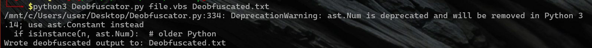

# VB Deobfuscator

A small Python utility to deobfuscate VBScript files produced by https://isvbscriptdead.com/ Online Obfuscator.
It attempts to simplify and recover readable VBScript code so analysts can inspect the logic, extract indicators, and locate embedded artifacts (comments, URLs, file names, etc.).

# Usage :
python3 deobfuscator.py <obfuscated.vbs> [out.txt]

